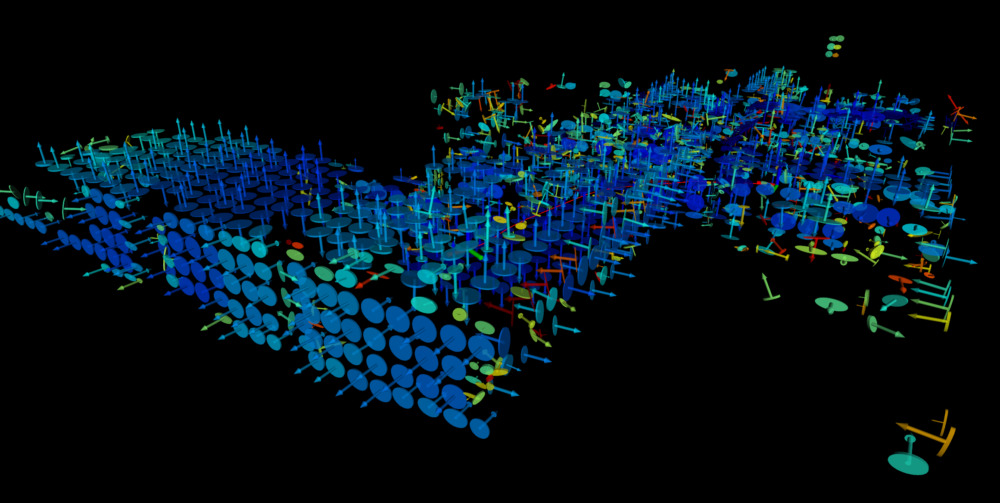
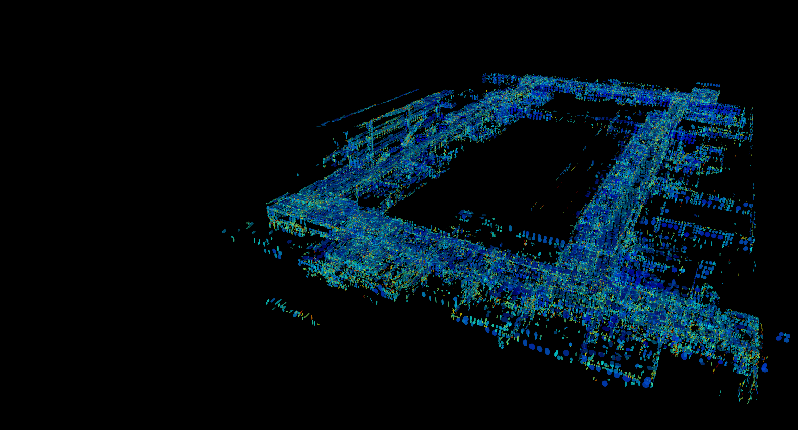

# VINA-SLAM: A Voxel-based Inertial and Normal-Aligned LiDAR–IMU SLAM

Environments with sparse or repetitive geometric structures, such as long corridors and narrow stairwells, remain challenging for LiDAR-IMU SLAM. In these scenarios, insufficient geometric observability and noisy associations commonly degrade the reliability of tracking and optimization modules.

To address these limitations, we propose a novel LiDAR-IMU SLAM framework, \textbf{VINA-SLAM}, which establishes a unified 3D global voxel map and collects global structure cues into the voxel map.
To be specific, VINA-SLAM first continuously tracks surface normals stored in the global voxel map using a normal-guided correspondence strategy.

Then, a tangent-space metric is further proposed to explicitly supplement rotational constraints around planar regions into a local bundle adjustment module, providing robust initial pose estimates even in geometrically degenerate regions. Specifically, the VNC (Vector Normal Consistency) module computes a 3D vector residual `r = S * n_scan_world` where `S = I - n_map * n_map^T` projects onto the map normal's tangent plane, yielding a rank-2 constraint per normal pair that constrains two rotation DOFs. Map plane matching uses a 27-neighbor voxel search with normal consistency filtering (rejecting pairs with angular deviation > 45 degrees) to prevent cross-structure mismatches.

Finally, we formulate a sliding-window bundle adjustment module that tightly couples IMU factors, normal consistency factors, and planar constraints. A key component is the use of the minimum eigenvalue of each voxel's covariance, as a statistically principled planar factor that improves the Hessian condition number and enhances cross-view geometric consistency.





## Running

```bash
source /opt/ros/humble/setup.bash
source install/setup.bash
ros2 launch vina_slam start.launch.py
```

## ROS 2 Outputs

- Live pose is published as TF: `camera_init -> aft_mapped`
- Current accumulated trajectory is published on `/curr_path` as `sensor_msgs/msg/PointCloud2`
- Registered scan is published on `/cloud_registered`
- Global map is published on `/global_map`
- Local map is published on `/cloud_map`

`/aft_mapped_to_init` is reserved for odometry output, but the current runtime path visualization relies on TF
and `/curr_path`.

## RViz Trajectory Display

The path display in the default RViz config subscribes to `/curr_path`.

`/curr_path` publishes the full accumulated trajectory snapshot, not incremental single-point updates. To avoid
seeing duplicated path snapshots after trajectory refinement, the default RViz config keeps:

- Topic: `/curr_path`
- Display type: `PointCloud2`
- `Decay Time: 0`

When the system is reset, VINA-SLAM now publishes an empty message on `/curr_path` so the old trajectory is
cleared before a new trajectory starts.

`/map_path` was a legacy topic name and is no longer used by the current launch + RViz configuration.

### 📖 Citation

If you use VINA-SLAM for any academic work, please cite our original [paper](https://www.mdpi.com/1424-8220/26/6/1810)

```
@article{zhang2026vina,
title={VINA-SLAM: A Voxel-Based Inertial and Normal-Aligned LiDAR--IMU SLAM},
author={Zhang, Ruyang and Sun, Bingyu},
journal={Sensors},
volume={26},
number={6},
pages={1810},
year={2026},
publisher={MDPI}
}
```

### Acknowledgements

- Thanks for [VoxelMap](https://github.com/hku-mars/VoxelMap).
- Thanks for [Voxel-SLAM](https://github.com/hku-mars/Voxel-SLAM).
